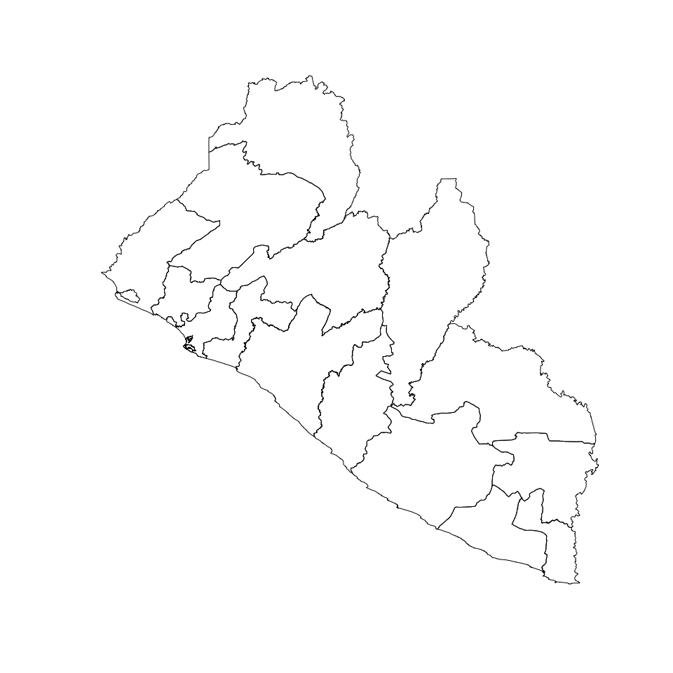
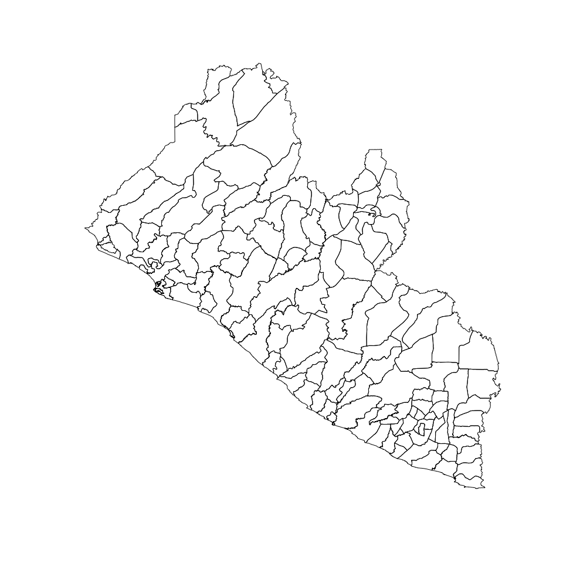
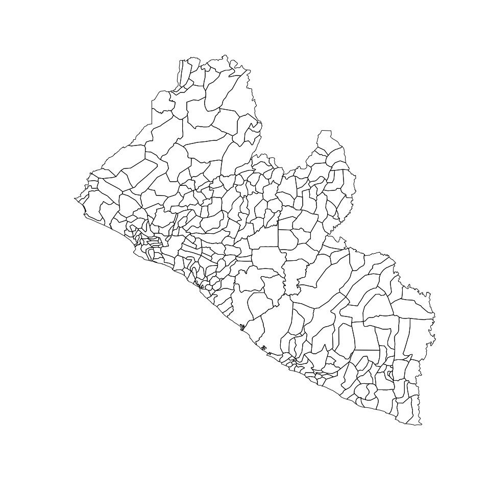

<!-- README.md is generated from README.Rmd. Please edit that file -->

# liberia: Datasets for Use in Designing Surveys in Liberia 

<!-- badges: start -->

[](https://www.repostatus.org/#active)
[](https://github.com/spatialworks/liberia/actions)
[](https://www.codefactor.io/repository/github/spatialworks/liberia)
<!-- badges: end -->

Designing surveys require relevant datasets to be used as basis for
sample size calculations, sampling design, survey planning/logistics and
survey implementation. These include datasets on population, lists of
sampling clusters, map datasets for spatial sampling, and previous
survey datasets that can be used for estimating indicator variance and
design effects. This package contains relevant datasets for use in
designing surveys in Liberia.

## Installation

Install `liberia` package from GitHub via \`remotes\`\`:

``` r
if (!require(remotes)) install.packages("remotes")
remotes::install_github("spatialworks/liberia")
```

## Usage

### Counties map

``` r
plot(sf::st_geometry(counties))
```



### Districts map

``` r
plot(sf::st_geometry(districts))
```



### Clans map

``` r
plot(sf::st_geometry(clans))
```



### Locality population

``` r
locality
#> # A tibble: 3,412 × 9
#>      FID County      District  Clan    `Locality/ Town`  MALE FEMALE TOTAL    HH
#>    <dbl> <chr>       <chr>     <chr>   <chr>            <dbl>  <dbl> <dbl> <dbl>
#>  1  3555 Grand Bassa District… Kpogbl… Cotton Tree          7      4    11     4
#>  2  3556 Grand Bassa District… L A C … 10 Dollars Camp     35     42    77    15
#>  3  3557 Grand Bassa District… L A C … 15 Houses Camp      91     86   177    21
#>  4  3558 Grand Bassa District… L A C … 3 Old Camp          62     56   118    38
#>  5  3559 Grand Bassa District… L A C … 3.2 Office           4      2     6     1
#>  6  3560 Grand Bassa District… L A C … 5 House Camp        25     26    51    11
#>  7  3561 Grand Bassa District… L A C … 6 Houses Camp      162    135   297    57
#>  8  3562 Grand Bassa District… Faitro  Adolphus           118    114   232    46
#>  9  3563 Grand Bassa District… Gaye P… Alex Johnson        27     28    55     8
#> 10  3564 Grand Bassa District… Zuzohn  Alex Village         5      2     7     3
#> # … with 3,402 more rows
```

### Enumeration areas population

``` r
enumerationArea
#> # A tibble: 751 × 8
#>    County      District     Clan                 EACODE  MALE FEMALE    HH TOTAL
#>    <chr>       <chr>        <chr>                 <dbl> <dbl>  <dbl> <dbl> <dbl>
#>  1 Grand Bassa Commonwealth Upper Buchanan Co…   9.12e8   119    123    44   242
#>  2 Grand Bassa Commonwealth Gorzohn Community    9.12e8   160    174    70   334
#>  3 Grand Bassa Commonwealth Central Buchanan     9.12e8   147    158    53   305
#>  4 Grand Bassa Commonwealth Korkorwein/Old Ba…   9.12e8   196    189    56   385
#>  5 Grand Bassa Commonwealth Central Buchanan     9.12e8   209    210    73   419
#>  6 Grand Bassa Commonwealth Central Buchanan     9.12e8   287    288   104   575
#>  7 Grand Bassa Commonwealth Gorzohn Community    9.12e8   265    301    98   566
#>  8 Grand Bassa Commonwealth Gorzohn Community    9.12e8   258    324   114   582
#>  9 Grand Bassa Commonwealth Gorzohn Community    9.12e8    86     99    31   185
#> 10 Grand Bassa Commonwealth Central Buchanan     9.12e8   205    169    66   374
#> # … with 741 more rows
```

### Monrovia population

``` r
monrovia
#> # A tibble: 166 × 6
#>    County      District         `Town/ Locality`     Male Female Total
#>    <chr>       <chr>            <chr>               <dbl>  <dbl> <dbl>
#>  1 Montserrado Greater Monrovia Bernard Quarters     1822   1739  3561
#>  2 Montserrado Greater Monrovia Grandcess Yard       3070   3470  6540
#>  3 Montserrado Greater Monrovia Johnsonville Road A  2677   3047  5724
#>  4 Montserrado Greater Monrovia Kaba Town            2939   3066  6005
#>  5 Montserrado Greater Monrovia Rock Spring Valley   1956   1850  3806
#>  6 Montserrado Greater Monrovia Soniwein             3293   3103  6396
#>  7 Montserrado Greater Monrovia Warwein               773    726  1499
#>  8 Montserrado Greater Monrovia 72nd Community       6883   7516 14399
#>  9 Montserrado Greater Monrovia A.B Tolbert Road     3195   3522  6717
#> 10 Montserrado Greater Monrovia Barchue Town         1561   1606  3167
#> # … with 156 more rows
```
