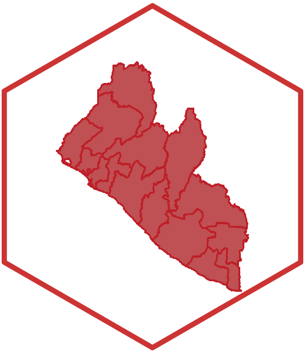

<!-- README.md is generated from README.Rmd. Please edit that file -->
liberia: Datasets for Use in Designing Surveys in Liberia 
=========================================================================================================================

[](https://www.tidyverse.org/lifecycle/#maturing)
[](https://travis-ci.org/validmeasures/liberia)
[](https://ci.appveyor.com/project/validmeasures/liberia)

Designing surveys require relevant datasets to be used as basis for
sample size calculations, sampling design, survey planning/logistics and
survey implementation. These include datasets on population, lists of
sampling clusters, map datasets for spatial sampling, and previous
survey datasets that can be used for estimating indicator variance and
design effects. This package contains relevant datasets for use in
designing surveys in Liberia.

Installation
------------

Install `liberia` package from GitHub via `devtools`:

``` r
if(!require(devtools)) install.packages("devtools")
install_github("validmeasures/liberia")
```
